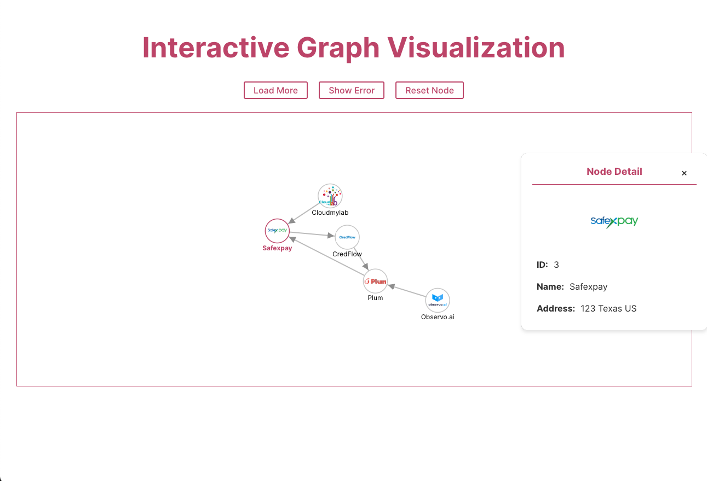
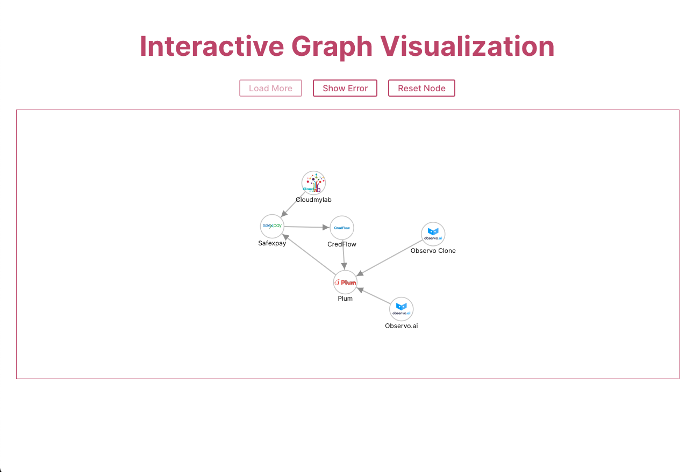
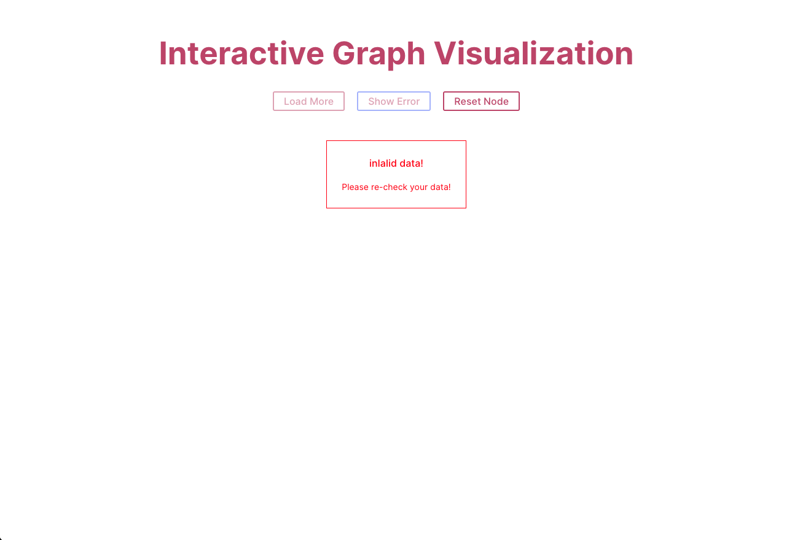
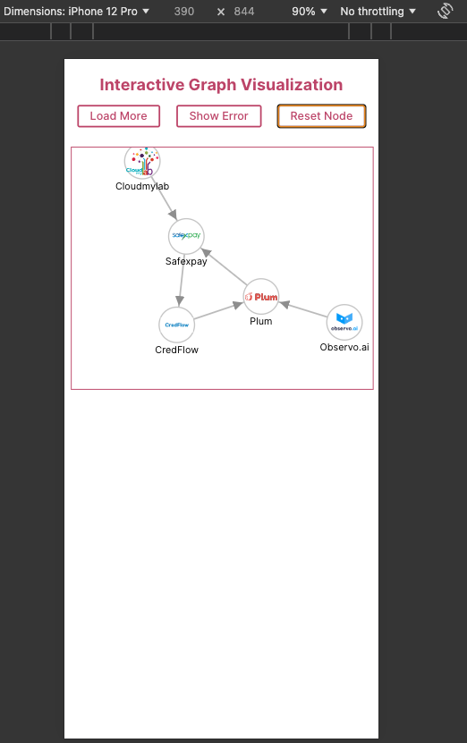
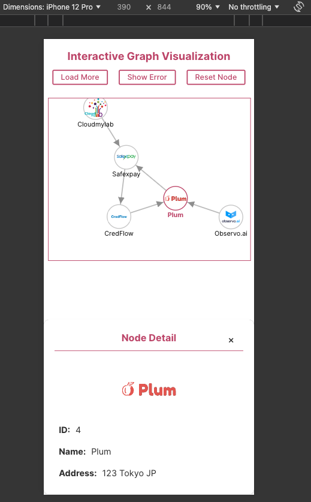

## Interactive Graph Visualization Component

### Get Started

```
  npm install
  npm run dev
```

### Deployment

```
  npm run build
```

### Functional Requirements

#### 3.1 Input Specifications

- I use mock json file in this repo ✅

#### 3.2 Graph Visualization

- Graph Layout ✅
- Node Representation ✅
- Edge Representation ✅

#### 3.3 Interactive Features

- Node Dragging ✅
- Node Selection ✅
  - Node Highlighting
  - Side Drawer
- The drawer will close automatically ✅
  - select another node
  - press on close modal button
  - press outside the Box (Don't press on the Chart Box. This is the current behavior)

#### 3.4 Output Specifications

- Graph Visualization ✅
- Node Details ✅

#### 3.5 UI/UX Requirements

- Side Drawer ✅
- Node and Edge Style ✅
- Responsive ✅

#### 3.6 Error Handling

- Show error message for invalid data ✅

### 4. Non-Functional Requirements

#### 4.1 Performance

I have 4 solutions for this

- zooom to support show overview and detail. It's so hard if we see all node on a screen
- lazy load node ✅
  - the data should come from API. so We should add a pagination for this.
  - I will mock a object to fake the function to show more nodes
- expand the node the see the next one when we press on it 🗒️ (We can consider this one. It's depend on the output)
- filter function 🗒️ (We can show a group with the filter).

#### 4.2 Maintainability

- Created the component to reuse ✅
- Created theme variable to reuse ✅

#### 4.3 Compatibility

- Should be work on mutiple browsers ✅

#### 4.4 Security

- prevent potential security risks 👨‍💻(in progress)

### 5. Constraints

- Used the packages from requirement ✅

```
  "d3": "^7.9.0",
  "react": "^18.3.1",
  "styled-components": "^6.1.13",
```

### 6. Dependencies

- React ✅
- D3.js ✅

### 7. User Stories

- Dragging nodes ✅
- View additional details ✅
- dynamically arrange the graph layout ✅

### 8. Glossary

- Node ✅
- Link ✅
- Side Drawer ✅

### Tech Stacks and libs

- Vite
- Reactjs
- Styled-components (CSS-in-JS libraries)
- D3.js ( graph layout and rendering of nodes and links)
- zustand (state management)

### Capture Output





Mobile:


